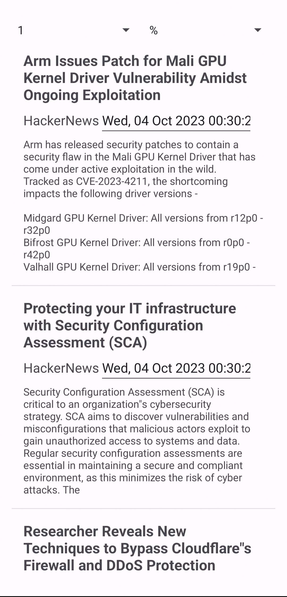
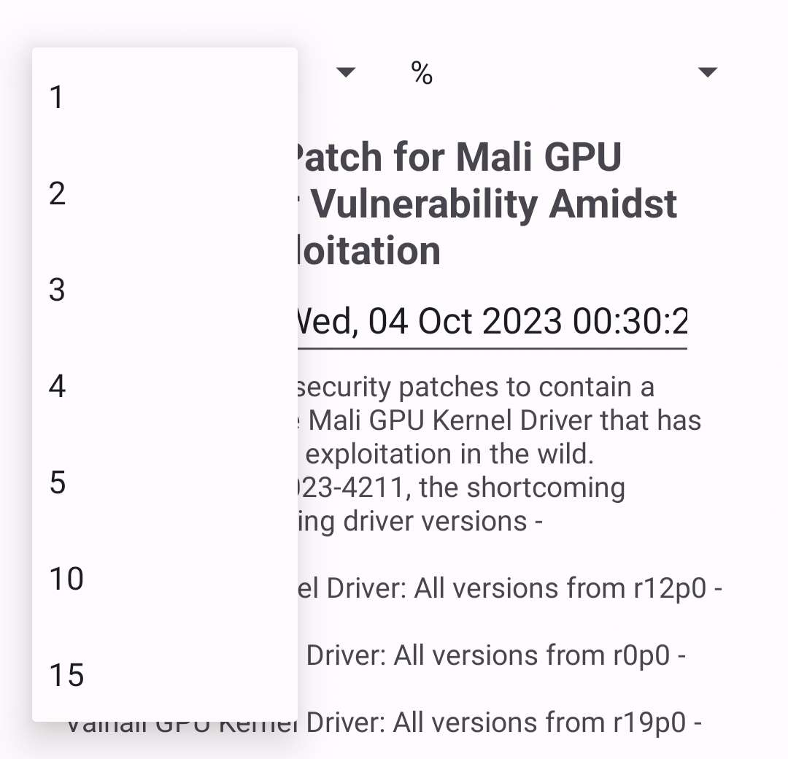
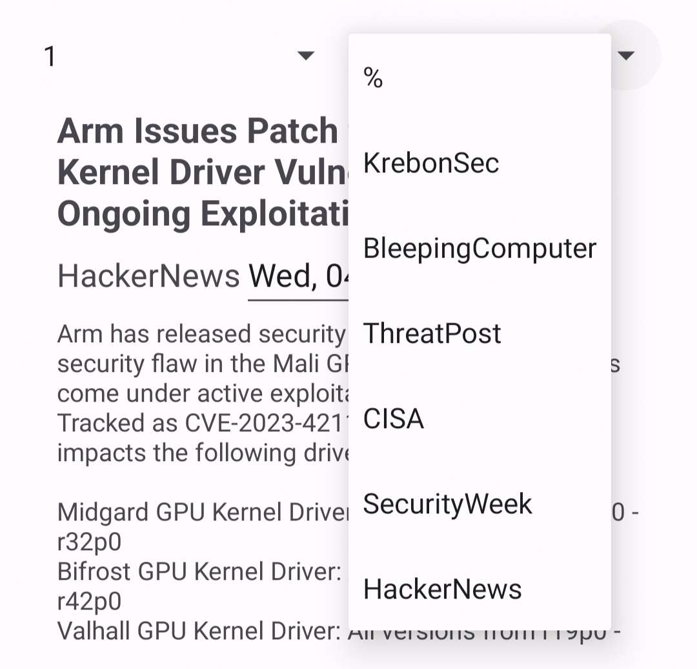

# SecureTrends-MobileApp

## Principle
Discover our cyber-focused technological intelligence API! Powered by RSS feeds from leading cyber news sites, this API keeps you constantly informed about the latest advancements and emerging threats in the field of cybersecurity.

With this technological intelligence API, you can easily integrate cyber news RSS feeds into your own applications, monitoring systems, or customized dashboards. In real-time, you receive updates on new vulnerabilities, ongoing attacks, cybersecurity trends, and best practices to safeguard your data.

## Installation
This application runs only on android mobile.
To install it, download the Apk and run setup.

## Usage

### Main menu

### Filters

2 filters possible: 

- Interval: Number of days (from today) displayed in app
- Platform: Source of articles displayed in app

